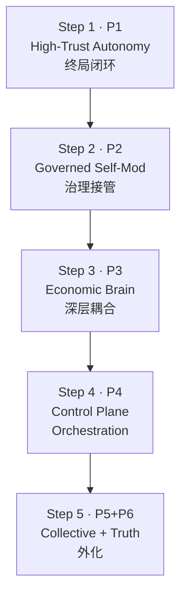

# ConShellV2 Round 19.1 — Remaining Mainline Closure & Final Completion Roadmap

> **审计基线**: 2026-03-20，全局完成度约 82%（置信度：中）  
> **本文性质**: 统领 19.x 后续开发的母版路线图

---

## A. 剩余主线总清单（Remaining Mainlines Master List）

| # | Priority | Mainline | currentState | dependsOn | blocksWhat |
|---|----------|----------|-------------|-----------|------------|
| 1 | **P1** | High-Trust Continuous Autonomy Final Closure | runtime 已有 materializer/task-queue/agent-loop/scheduler/agenda；JIT re-eval 与 fault discipline 已落地；但 wake semantics、long-horizon mission continuity、live-drift suppression 尚未终局 | — | P2, P4, P5 |
| 2 | **P2** | Governed Self-Modification / Replication / Evolution | selfmod 有 propose→approve→apply→verify→rollback 完整链（288 LOC）；evomap (3 files)、lineage (6 files) 已有基础；但 replication viability、capability inheritance、quarantine/merge/kill 治理闭环尚未终局 | P1 governance coherence | P5 |
| 3 | **P3** | Full-System Economic Brain Closure | economic 模块最深（57+ files），settlement/feedback/ledger/survival-loop/mandate-engine 已成熟；但 execution-time economics 与 survival posture 的深层耦合、operator-facing explainability 尚未终局 | P1 execution coherence | P6 |
| 4 | **P4** | OpenClaw Control Plane Absorption | channels (15 files, 6 adapters)、facilitator、multiagent 已有基础；但 multi-session orchestration、gateway/cron/wake/node 深统一尚未终局 | P1, P3 | P5 |
| 5 | **P5** | Collective / Distributed Lifeform Deepening | collective (13 files)、trust-model、reputation-service、discovery 已有基础；但 collective governance、distributed authority、group-level evolution 尚未终局 | P1, P2, P3, P4 | P6 |
| 6 | **P6** | Web4 / Operator Truth Externalization | api-surface 仅有测试文件无实现；x402 (2 files)、dashboard (2 files) 基础薄弱；machine-readable posture、diagnosis-first truth surfaces 未启动 | P3, P5 | — |
| 7 | **P7** | Release / Packaging / Publish Closure | **明确后置** — monorepo publish train、CLI installability、RC gates 全部延后 | P1–P6 | — |

---

## B. 优先级排序理由（Priority Ranking Summary）

### P1 — High-Trust Continuous Autonomy（最高优先级）
**Why now**: 自治是生命体的根基。19.0 完成了 `CommitmentMaterializer` 和 JIT re-evaluation，但 wake semantics、long-horizon mission continuity、live-drift suppression 是从"能恢复"到"能持续活着"的关键跳跃。所有后续主线（P2-P6）都依赖这条线的稳定性。

**Evidence**: `runtime/` 20 files, `agenda/` 6 files, `scheduler/` 4 files, `kernel/` 6 files — 基础设施成熟，但缺乏 durable background operation 和 long-horizon re-entry suppression 终局。

### P2 — Governed Self-Modification / Evolution（第二优先级）
**Why now**: 真正的生命体必须能安全自我修改。`selfmod/index.ts` 已有完整的 propose→apply→rollback 链，但缺少 replication viability、capability inheritance 统一、quarantine/merge/kill 治理闭环。

**Evidence**: `selfmod/` 2 files (288 LOC), `evomap/` 3 files, `lineage/` 6 files — 有骨架，缺终局治理统一。

### P3 — Full-System Economic Brain（第三优先级）
**Why now**: 经济是最深的模块（57+ files），settlement 和 feedback 已成熟，但 execution-time economics 尚未深度耦合到 survival posture，operator 无法看到 explainable economic truth。

**Evidence**: `economic/` 57+ files, 17+ test suites — 最成熟的模块，但深层耦合和 explainability 缺失。

### P4 — OpenClaw Control Plane（第四优先级）
**Why now**: Channels 已有 6 个 adapter（Discord, Slack, Telegram, WhatsApp, Matrix, Webchat），但 multi-session orchestration 和 gateway/cron/wake 深度统一尚未落地。

**Evidence**: `channels/` 15 files, `facilitator/`, `multiagent/` — 有广度，缺深度统一。

### P5 — Collective / Distributed（第五优先级）
**Why now**: 依赖 P1-P4 的成熟度。Trust model、reputation service、peer selector 已有基础，但 collective governance 和 distributed authority 尚需 P1 的自治和 P2 的演化作为前置。

**Evidence**: `collective/` 13 files — 有实质性基础，但终局依赖上游主线。

### P6 — Web4 / Operator Truth（第六优先级）
**Why now**: `api-surface/` 仅有 1 个测试文件，无实际实现。内部真相必须先收口（P1-P5），然后才能可信地外化。

**Evidence**: `api-surface/` 1 file (test only), `x402/` 2 files, `dashboard/` 2 files — 最薄弱的区域。

### P7 — Release / Packaging（明确后置）
**Why**: 用户已多次明确先完成再发布。当前最决定终局的不是包装，而是主线能力收口。

---

## C. Must-Finish-Now 集合

| Mainline | mustFinishNow |
|----------|--------------|
| **P1** | execution-time conflict reasoning 终局；stale/duplicate/partial-restore 高可信规则；agenda/queue/execution coherence 收口；resume→execution→completion→re-entry suppression 闭环 |
| **P2** | self-mod full chain governance 接管；quarantine/revoke/pause/recovery 闭环；lineage/branch governance receipt 基础 |
| **P3** | execution-time economics 与 survival 深层耦合；profitability/runtime/agenda 统一 owner；receive-first/spend-within-mandate 终局强制 |

---

## D. Should-Finish-Next 集合

| Mainline | shouldFinishNext |
|----------|-----------------|
| **P1** | wake semantics; durable background operation; long-horizon mission continuity |
| **P2** | replication viability; capability inheritance 统一 |
| **P3** | operator-facing economic truth/explainability/diagnostics |
| **P4** | multi-session orchestration 终局; channels/sessions/tools/runtime workers 深统一 |
| **P5** | lineage/child/branch/collective 终局约束关系 |
| **P6** | machine-readable identity/autonomy/governance posture basics |

---

## E. Can-Defer 集合

| Mainline | canDefer |
|----------|---------|
| **P4** | gateway/cron/remote control 完整 UI 界面 |
| **P5** | 群体级 swarm consensus; group-level evolution 完整语义 |
| **P6** | 完整 Web4 外部接口超出 diagnostic truth 范围的部分 |
| **P7** | CLI installability; NPM publish train; RC/beta release gates（全部延后） |

---

## F. Completion-First 路线图

| Step | Round(s) | 核心目标 | 完成后预期完成度 |
|------|----------|---------|---------------|
| **Step 1** | 19.2–19.4 | P1 终局: conflict reasoning, stale suppression, resume→completion closed loop | ~86% |
| **Step 2** | 19.5–19.6 | P2 终局: self-mod governance 接管, replication/lineage 统一 | ~89% |
| **Step 3** | 19.7–19.8 | P3 终局: execution-time economics, survival coupling, explainability | ~92% |
| **Step 4** | 20.0–20.1 | P4 终局: multi-session orchestration, channel deep unification | ~95% |
| **Step 5** | 20.2–20.3 | P5+P6: collective governance, external truth surfaces | ~97% |

> **注**: 发布主线（P7）在 Step 5 完成后才重新抬升优先级。

---

## G. Release Positioning

**当前立场**: P7 明确后置，不与核心主线竞争优先级。

**后置理由**:
1. 用户多次明确"先做完剩余功能与优化，再看发布"
2. 当前 82% 完成度的主要差距不在包装，而在核心主线能力收口
3. 过早发布会固化尚未终局的接口和行为

**重新抬升条件**:
- P1–P3 的 Must-Finish-Now 项全部关闭
- P4 的 multi-session orchestration 终局
- 全局测试保持 0 failure
- 预估完成度达到 ~95%

---

## H. 真实性声明

1. ✅ 剩余主线已完整列出（7 条），基于仓内模块扫描得出
2. ✅ 每条主线已按优先级排序，并附独立的 why-now 理由和仓内证据
3. ✅ must-finish / should-finish / can-defer 已正式三层分拆
4. ✅ completion-first 路线图已给出 5-step 顺序路径
5. ✅ 发布明确后置，并定义了重新抬升条件
6. ✅ 本文可直接作为 19.x 后续开发提示词的母版路线图
7. ❌ 未伪造 — can-defer 项未被伪装为已完成项

---

> **本文是 Round 19.1 的唯一正式产出。后续 19.2+ 的开发提示词应以本路线图为母版。**
